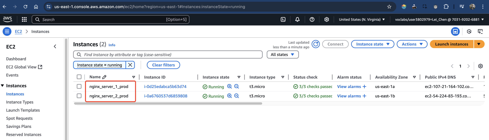
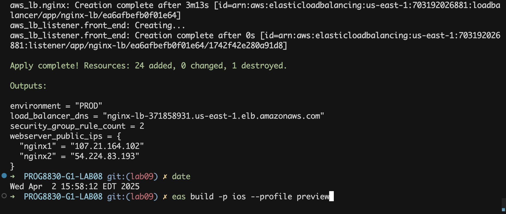

# Terraform Functions Implementation Report

We chose to implement two key functions:
`coalesce` from the Collection Functions category,
and `replace` from the String Functions category.

## Implementation Details

### 1. Coalesce Function

Fallback values for instance type selection are set in the aws_instance resource block. This allows flexible configuration and ensures a reliable default is used when no specific type is provided.

- Code Example:
  ```hcl
  instance_type = coalesce(var.instance_type, "t3.micro")
  ```

### 2. Replace Function

Simple naming rules are used for instances and IAM profiles. This helps keep all resource names the same patterns. It makes the system easier to use and manage.

- Code Example:
  ```hcl
  name = replace(lower("nginx-server-${i + 1}-${local.environment}"), "-", "_")
  ```

## Challenges and Solutions

The main challenge was keeping everything working with old settings when making changes. This was solved by keeping the old default values, setting the new instance_type variable to null by default, and making sure the new naming rules didn’t break any existing resource links.

The implementation gave us some useful tips of real configuration. Default values can be handled well with collection functions. String functions help keep names consistent. The setup which used those functions is works better in different environments.

Screenshots (lab09)



